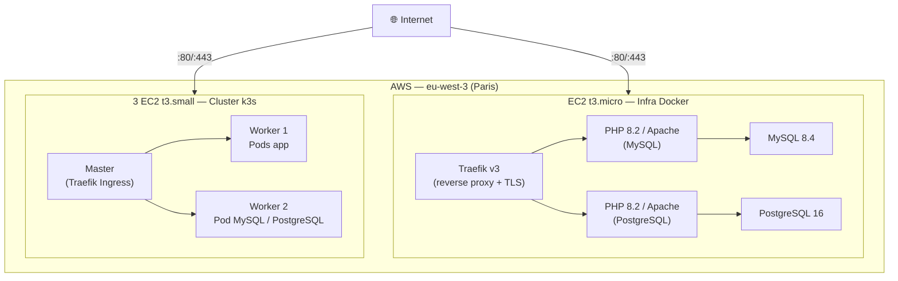

# Gestion Produits — Déploiement IaC & Conteneurisation

Déploiement automatisé d'une application PHP/MySQL sur deux infrastructures (Docker et Kubernetes) provisionnées via Terraform sur AWS.

**Auteur :** Attisso Rudolph — M1 DEV EPSI  
**Modules évalués :** IaC–Terraform (20 pts) · Conteneurisation avancée (20 pts)

---

## Architecture globale



---

## Prérequis

| Outil | Version minimale | Usage |
|---|---|---|
| [Terraform](https://developer.hashicorp.com/terraform/install) | 1.5+ | Provisionnement AWS |
| [AWS CLI](https://aws.amazon.com/cli/) | 2.x | Authentification AWS |
| [Docker](https://docs.docker.com/get-docker/) | 24+ | Build et run des conteneurs |
| [kubectl](https://kubernetes.io/docs/tasks/tools/) | 1.28+ | Administration du cluster K8s |
| Compte [Docker Hub](https://hub.docker.com) | — | Registry des images |
| Compte AWS | — | Hébergement des EC2 |

**Configurer les credentials AWS :**
```bash
aws configure
# AWS Access Key ID     : <ta clé>
# AWS Secret Access Key : <ta clé secrète>
# Default region        : eu-west-3
```

**Créer une key pair SSH dans AWS Console :**  
`EC2 > Key Pairs > Create key pair` — noter le nom, il sera utilisé dans les `tfvars`.

---

## Structure du dépôt

```
IAC_TP/
├── docker/
│   ├── app/                     ← Dockerfile variante MySQL
│   ├── app-pgsql/               ← Dockerfile variante PostgreSQL
│   └── compose/                 ← docker-compose.yml (MySQL + PostgreSQL)
├── gestion-produits/
│   ├── php/www/                 ← code source PHP
│   └── database/
│       ├── gestion_produits.sql      ← schéma MySQL
│       └── gestion_produits_pgsql.sql ← schéma PostgreSQL
├── kubernetes/
│   ├── mysql/                   ← manifests K8s variante MySQL
│   └── pgsql/                   ← manifests K8s variante PostgreSQL
└── terraform/
    ├── modules/ec2/             ← module EC2 réutilisable
    ├── docker-infra/            ← infra Docker (1 EC2)
    └── k8s-infra/               ← cluster k3s (3 EC2)
```

---

## 1. Déploiement de l'infrastructure Docker

### Configuration

```bash
cd terraform/docker-infra
cp terraform.tfvars.example terraform.tfvars
```

Éditer `terraform.tfvars` :
```hcl
aws_region          = "eu-west-3"
key_name            = "nom-de-ta-key-pair"
my_ip_cidr          = "TON_IP/32"        # curl ifconfig.me
repo_url            = "https://github.com/TON_COMPTE/IAC_TP.git"
db_user             = "app"
db_password         = "MotDePasseFort1!"
db_name             = "gestion_produits"
mysql_root_password = "MotDePasseRoot1!"
pgsql_user          = "app_pgsql"
pgsql_password      = "MotDePasseFort1!"
pgsql_db            = "gestion_produits"
```

### Déploiement

```bash
terraform init
terraform plan
terraform apply
```

### Résultats

```bash
terraform output
# docker_host_ip = "X.X.X.X"
# hosts_entry    = "X.X.X.X  gestion-produits.local"
# ssh_command    = "ssh -i <cle>.pem ec2-user@X.X.X.X"
```

> L'application se déploie automatiquement au démarrage de l'instance via le script `user_data`.  
> Attendre ~3 minutes après `apply` puis vérifier avec :

```bash
# Lister les instances AWS en cours d'exécution
aws ec2 describe-instances --region eu-west-3 \
  --query "Reservations[*].Instances[*].{Name:Tags[?Key=='Name']|[0].Value,State:State.Name,IP:PublicIpAddress,Type:InstanceType}" \
  --output table
```

> Si les conteneurs ne sont pas démarrés, se connecter en SSH et les lancer manuellement :

```bash
ssh -i <cle>.pem ec2-user@X.X.X.X
sudo chown -R ec2-user:ec2-user /opt/app
cd /opt/app && git pull
docker compose -f /opt/app/docker/compose/docker-compose.yml up -d
```

---

## 2. Déploiement de l'infrastructure Kubernetes

### Configuration

```bash
cd terraform/k8s-infra
cp terraform.tfvars.example terraform.tfvars
```

Éditer `terraform.tfvars` :
```hcl
aws_region = "eu-west-3"
key_name   = "nom-de-ta-key-pair"
my_ip_cidr = "TON_IP/32"
k3s_token  = "$(openssl rand -hex 32)"  # générer un token fort
```

### Déploiement

```bash
terraform init
terraform plan
terraform apply
```

### Récupération du kubeconfig

**Linux / Mac :**
```bash
ssh -i <cle>.pem ec2-user@X.X.X.X \
  'sudo cat /etc/rancher/k3s/k3s.yaml' \
  | sed 's/127.0.0.1/X.X.X.X/g' > ~/.kube/config
```

**Windows (PowerShell) :**
```powershell
ssh -i "$env:USERPROFILE\<cle>.pem" ec2-user@X.X.X.X 'sudo cat /etc/rancher/k3s/k3s.yaml' `
  | ForEach-Object { $_ -replace '127.0.0.1', 'X.X.X.X' } `
  | Set-Content "$env:USERPROFILE\.kube\config"
```

Si kubectl retourne une erreur TLS (`x509: certificate is valid for ... not X.X.X.X`) :
```powershell
(Get-Content "$env:USERPROFILE\.kube\config") `
  -replace 'certificate-authority-data:.*', 'insecure-skip-tls-verify: true' `
  | Set-Content "$env:USERPROFILE\.kube\config"
```

```bash
# Vérifier que le cluster est opérationnel
kubectl get nodes
```

---

## 3. Déploiement de l'application sur Docker

L'application est déployée automatiquement par Terraform via `user_data`. Pour redéployer manuellement :

```bash
# Se connecter au serveur
ssh -i <cle>.pem ec2-user@X.X.X.X

# Sur le serveur
cd /opt/app/docker/compose
docker compose ps          # vérifier l'état
docker compose logs -f     # consulter les logs
```

### Fichier `.env` sur le serveur

Le fichier `.env` est généré automatiquement par Terraform. Pour modifier les credentials :
```bash
nano /opt/app/docker/compose/.env
docker compose up -d
```

---

## 4. Déploiement de l'application sur Kubernetes

### Images Docker Hub

Les images sont déjà disponibles sur Docker Hub :
- `ranawane93/gestion-produits-mysql:latest`
- `ranawane93/gestion-produits-pgsql:latest`

Pour les rebuilder si nécessaire :
```bash
docker build -t ranawane93/gestion-produits-mysql:latest -f docker/app/Dockerfile .
docker push ranawane93/gestion-produits-mysql:latest

docker build -t ranawane93/gestion-produits-pgsql:latest -f docker/app-pgsql/Dockerfile .
docker push ranawane93/gestion-produits-pgsql:latest
```

### Déploiement des manifests

```bash
kubectl apply -f kubernetes/mysql/
kubectl apply -f kubernetes/pgsql/
```

### Créer les ConfigMaps d'initialisation SQL

```bash
kubectl create configmap db-init-sql \
  --from-file=init.sql=gestion-produits/database/gestion_produits.sql \
  -n gestion-produits

kubectl create configmap db-pgsql-init-sql \
  --from-file=init.sql=gestion-produits/database/gestion_produits_pgsql.sql \
  -n gestion-produits
```

### Vérification

```bash
kubectl get pods    -n gestion-produits
kubectl get ingress -n gestion-produits
```

Tous les pods doivent être `1/1 Running`.

---

## 5. Accès aux applications

Fichier `hosts` :
- **Linux / Mac :** `/etc/hosts`
- **Windows :** `C:\Windows\System32\drivers\etc\hosts`

Les deux infras utilisent les mêmes hostnames — **décommenter le bloc correspondant à l'infra à tester** :

```
# === Infra Docker (terraform/docker-infra) ===
# X.X.X.X  gestion-produits.local        ← docker_host_ip
# X.X.X.X  gestion-produits-pgsql.local

# === Infra Kubernetes (terraform/k8s-infra) ===
Y.Y.Y.Y  gestion-produits.local           ← master_public_ip
Y.Y.Y.Y  gestion-produits-pgsql.local
```

> Les IPs sont fournies par `terraform output` de chaque infra.

### URLs disponibles

| Infra | Variante | URL | Identifiants |
|---|---|---|---|
| Docker | MySQL | https://gestion-produits.local | admin / password |
| Docker | PostgreSQL | https://gestion-produits-pgsql.local | admin / password |
| Kubernetes | MySQL | https://gestion-produits.local | admin / password |
| Kubernetes | PostgreSQL | https://gestion-produits-pgsql.local | admin / password |

> Le navigateur affichera une alerte certificat (TLS auto-signé) — cliquer sur "Continuer quand même".

---

## 6. Nettoyage

```bash
# Supprimer l'infra Docker
cd terraform/docker-infra && terraform destroy

# Supprimer l'infra Kubernetes
cd terraform/k8s-infra && terraform destroy
```

> Penser à détruire les infras après correction pour éviter des frais AWS.

---

## Décisions techniques

| ADR | Décision |
|---|---|
| ADR-001 | Provider : AWS EC2 + k3s |
| ADR-002 | Reverse proxy : Traefik v3 |
| ADR-003 | Stockage K8s : local-path (RWO) |
| ADR-004 | Secrets K8s : Secrets natifs base64 |
| ADR-005 | Migration PostgreSQL : surcharge partielle Dockerfile |
| ADR-006 | Registry images : Docker Hub |
