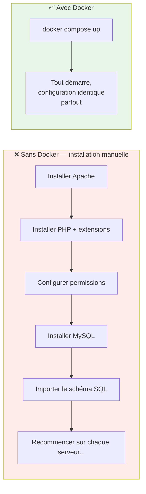
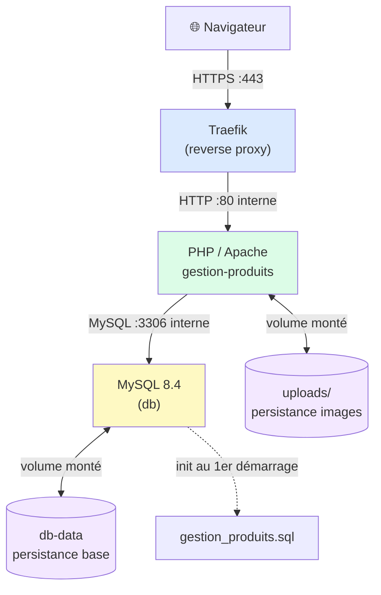
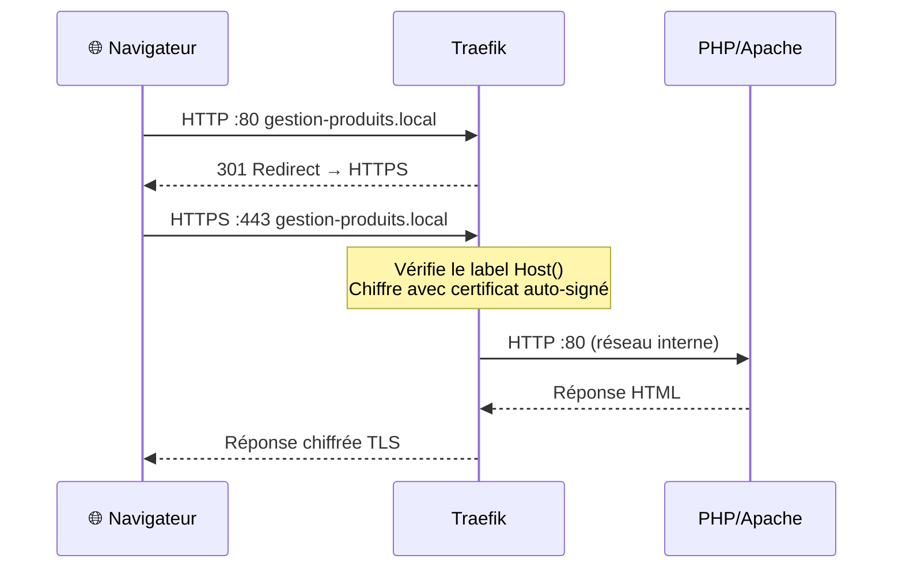
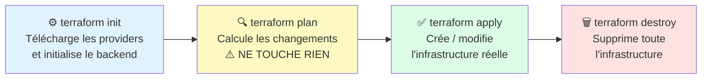
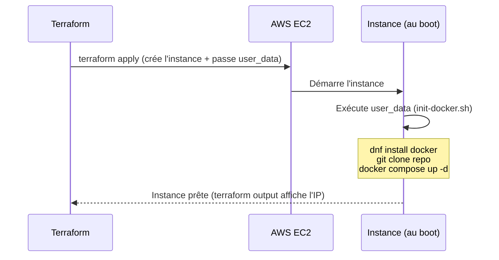
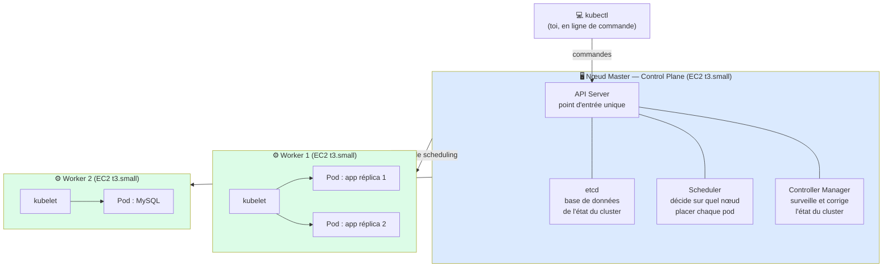
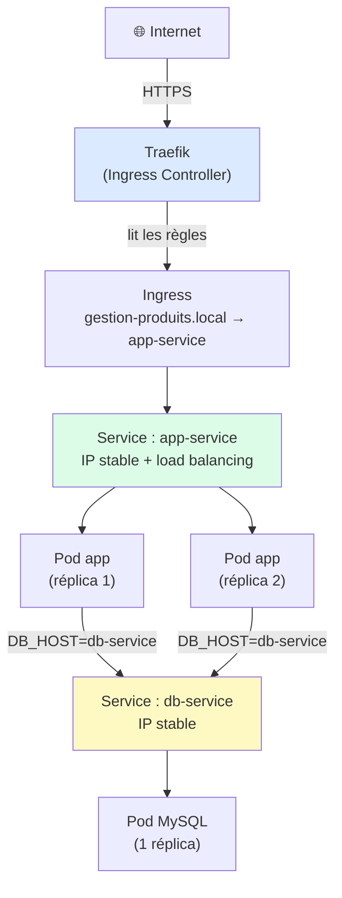
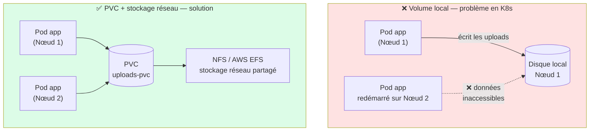
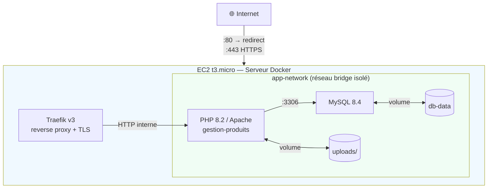
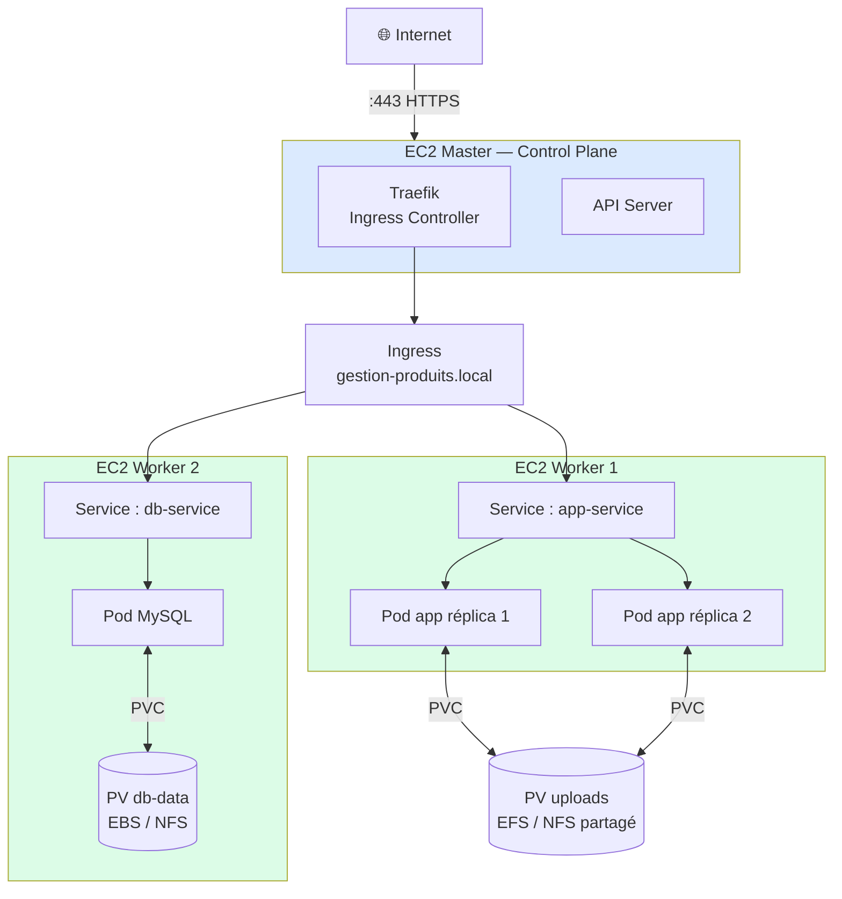

# Cours — Infrastructure as Code & Conteneurisation avancée

> Ce document est un guide pédagogique complet du projet. Il explique **chaque étape**, **pourquoi elle existe**, et **les contraintes qui la justifient**. Il se lit de haut en bas, dans l'ordre de construction du projet.

---

## Sommaire

1. [Le projet en une phrase](#1-le-projet-en-une-phrase)
2. [L'application source](#2-lapplication-source)
3. [Pourquoi Docker ?](#3-pourquoi-docker-)
4. [Le Dockerfile — anatomie et contraintes](#4-le-dockerfile--anatomie-et-contraintes)
5. [Les variables d'environnement — pourquoi jamais de secrets dans le code](#5-les-variables-denvironnement--pourquoi-jamais-de-secrets-dans-le-code)
6. [docker-compose — orchestrer plusieurs conteneurs](#6-docker-compose--orchestrer-plusieurs-conteneurs)
7. [Le reverse proxy — pourquoi on n'expose pas l'app directement](#7-le-reverse-proxy--pourquoi-on-nexpose-pas-lapp-directement)
8. [Traefik — le choix et comment ça fonctionne](#8-traefik--le-choix-et-comment-ça-fonctionne)
9. [TLS — pourquoi HTTPS même en local / en cours](#9-tls--pourquoi-https-même-en-local--en-cours)
10. [Infrastructure as Code — pourquoi Terraform](#10-infrastructure-as-code--pourquoi-terraform)
11. [AWS EC2 — le choix du provider](#11-aws-ec2--le-choix-du-provider)
12. [Terraform — structure et concepts clés](#12-terraform--structure-et-concepts-clés)
13. [Kubernetes — pourquoi, et différence avec Docker Compose](#13-kubernetes--pourquoi-et-différence-avec-docker-compose)
14. [k3s — Kubernetes léger sur EC2](#14-k3s--kubernetes-léger-sur-ec2)
15. [Les objets Kubernetes essentiels](#15-les-objets-kubernetes-essentiels)
16. [Le stockage persistant en K8s — pourquoi c'est un problème](#16-le-stockage-persistant-en-k8s--pourquoi-cest-un-problème)
17. [Les secrets en Kubernetes](#17-les-secrets-en-kubernetes)
18. [Variante PostgreSQL — pourquoi migrer et comment](#18-variante-postgresql--pourquoi-migrer-et-comment)
19. [Sécurité — récapitulatif des bonnes pratiques](#19-sécurité--récapitulatif-des-bonnes-pratiques)
20. [Schéma d'ensemble](#20-schéma-densemble)

---

## 1. Le projet en une phrase

Prendre une application PHP/MySQL existante, la **conteneuriser**, la déployer sur **deux types d'infrastructure** (Docker seul, puis Kubernetes), et provisionner ces infrastructures de manière **reproductible via Terraform**.

L'objectif pédagogique est de comprendre pourquoi et comment on automatise tout ce qui était autrefois fait "à la main" sur un serveur.

---

## 2. L'application source

L'application `gestion-produits` est une app PHP 8 classique :

```
php/www/
├── index.php          ← liste des produits
├── produit.php        ← fiche produit
├── form_produit.php   ← formulaire ajout/édition
├── auth.php           ← authentification
├── connect.php        ← connexion base de données
├── fonctions.php      ← logique métier
├── validation.php     ← validation formulaires
└── uploads/           ← images des produits (fichiers uploadés)
```

La base de données contient 3 tables :
- `produits` — catalogue
- `ressources` — images liées aux produits
- `utilisateurs` — compte admin (login: `admin`, password hashé SHA-256)

**Contrainte critique :** le dossier `uploads/` contient des fichiers générés à l'exécution. Si ce dossier est dans un conteneur sans volume, **toutes les images disparaissent au redémarrage**. C'est pour ça qu'on utilise un volume Docker (voir section 6).

---

## 3. Pourquoi Docker ?

Avant Docker, déployer une application PHP voulait dire :
1. Installer Apache/Nginx sur le serveur
2. Installer PHP avec les bonnes extensions
3. Configurer les droits de fichiers
4. Installer MySQL, créer la base, importer le schéma
5. Répéter tout ça identiquement sur chaque serveur

Le moindre écart (version PHP différente, extension manquante) cassait l'application.

**Docker résout ça** en empaquetant l'application avec tout ce dont elle a besoin dans une **image** — une unité autosuffisante et portable. Une fois l'image construite, elle tourne de manière identique sur n'importe quelle machine.

Concepts fondamentaux :

| Concept | Analogie | Description |
|---|---|---|
| **Image** | Recette de cuisine | Blueprint immuable — définit CE QUE contient le conteneur |
| **Conteneur** | Plat préparé | Instance en cours d'exécution d'une image |
| **Dockerfile** | La recette écrite | Série d'instructions pour construire l'image |
| **Volume** | Disque externe branché | Stockage persistant, survit aux redémarrages du conteneur |
| **Réseau** | LAN virtuel | Permet aux conteneurs de se parler par nom |



---

## 4. Le Dockerfile — anatomie et contraintes

```dockerfile
FROM php:8.2-apache
```

**Pourquoi cette image de base ?**  
`php:8.2-apache` est l'image officielle PHP maintenue par l'équipe PHP. Elle contient Apache préconfiguré pour servir du PHP. Choisir une image officielle minimale réduit la surface d'attaque (moins de paquets = moins de vulnérabilités potentielles).

```dockerfile
RUN docker-php-ext-install pdo pdo_mysql
```

**Pourquoi cette ligne ?**  
L'image de base PHP ne contient pas toutes les extensions par défaut. `pdo_mysql` est l'extension qui permet à PHP de parler à MySQL via PDO (l'interface qu'utilise `connect.php`). Sans ça, la connexion à la base échoue silencieusement ou avec une erreur cryptique.

```dockerfile
COPY gestion-produits/php/www/ /var/www/html/
```

**Pourquoi `/var/www/html/` ?**  
C'est le dossier racine par défaut d'Apache. Tout fichier déposé là est automatiquement servi par le serveur web. C'est une convention Apache, pas un choix arbitraire.

```dockerfile
RUN chown -R www-data:www-data /var/www/html/uploads \
    && chmod 755 /var/www/html/uploads
```

**Pourquoi ce bloc ?**  
Apache tourne sous l'utilisateur `www-data` à l'intérieur du conteneur. Quand un utilisateur uploade une image, c'est `www-data` qui écrit le fichier. Si `www-data` n'est pas propriétaire du dossier `uploads/`, l'upload échoue avec une erreur de permission. Le `chmod 755` donne les droits d'écriture au propriétaire, lecture aux autres.

**Règle de sécurité :** on ne tourne jamais en `root` dans un conteneur. Si le conteneur est compromis et tourne en root, l'attaquant a les droits root sur l'hôte aussi. `www-data` limite le blast radius.

---

## 5. Les variables d'environnement — pourquoi jamais de secrets dans le code

Le fichier `connect.php` original contenait :
```php
$host = 'localhost';
$username = 'root';
$password = 'root';
```

C'est une erreur classique et dangereuse pour deux raisons :

1. **Secrets dans git** — dès que ce fichier est commité, le mot de passe est dans l'historique git pour toujours (même si on le supprime ensuite, il reste dans les commits précédents).

2. **Pas configurable** — si on veut déployer sur un autre serveur ou changer le mot de passe, il faut modifier le code source.

**La solution : variables d'environnement**

```php
$host     = getenv('DB_HOST');
$username = getenv('DB_USER');
$password = getenv('DB_PASSWORD');
$dbname   = getenv('DB_NAME');
```

Les variables d'environnement sont injectées au moment du démarrage du conteneur, sans jamais toucher au code. Le code ne sait pas ce que valent ces variables — il les lit depuis l'environnement.

**Le fichier `.env`** (jamais commité, dans `.gitignore`) :
```
DB_USER=app
DB_PASSWORD=changeit
DB_NAME=gestion_produits
MYSQL_ROOT_PASSWORD=rootchangeit
```

**Le fichier `.env.example`** (commité) : même structure, valeurs vides ou factices. Permet à quelqu'un qui clone le repo de savoir quelles variables configurer.

---

## 6. docker-compose — orchestrer plusieurs conteneurs

L'application a besoin de trois conteneurs qui travaillent ensemble :
- Un conteneur **Traefik** (reverse proxy, seul point d'entrée)
- Un conteneur **PHP/Apache** (l'app)
- Un conteneur **MySQL** (la base de données)

`docker-compose` permet de décrire ces trois services dans un seul fichier YAML et de les démarrer d'un coup.



### Pourquoi `depends_on` avec `condition: service_healthy` ?

```yaml
depends_on:
  db:
    condition: service_healthy
```

Sans ça, Docker démarre les deux conteneurs en parallèle. L'app PHP essaie de se connecter à MySQL avant que MySQL soit prêt à accepter des connexions, et plante. Le `healthcheck` sur le service `db` fait en sorte que Docker attend que MySQL réponde avant de démarrer l'app.

### Pourquoi un réseau dédié ?

```yaml
networks:
  app-network:
    driver: bridge
```

Par défaut, Docker met tous les conteneurs sur le réseau bridge par défaut — ce qui signifie que tous les conteneurs de toutes vos applications peuvent se voir. Créer un réseau dédié isole les services : seuls les conteneurs du projet peuvent se parler.

### Pourquoi un volume pour `uploads/` ?

```yaml
volumes:
  - uploads:/var/www/html/uploads
```

Les conteneurs sont **éphémères** — à chaque `docker compose down`, tout ce qui est dans le conteneur disparaît. Sans volume, les images uploadées sont perdues à chaque redémarrage. Le volume est géré par Docker sur le système hôte et survit à la vie du conteneur.

### Pourquoi un volume pour la base de données ?

```yaml
volumes:
  - db-data:/var/lib/mysql
```

Même raison : `/var/lib/mysql` est là où MySQL stocke ses données. Sans volume, la base est vide à chaque redémarrage — catastrophique en production.

### L'initialisation automatique de la base

```yaml
- ../../gestion-produits/database/gestion_produits.sql:/docker-entrypoint-initdb.d/init.sql:ro
```

L'image officielle MySQL a un comportement intégré : au premier démarrage, elle exécute automatiquement tous les fichiers `.sql` placés dans `/docker-entrypoint-initdb.d/`. En montant notre script SQL à cet emplacement, la base est créée et peuplée automatiquement au premier lancement — zéro intervention manuelle.

---

## 7. Le reverse proxy — pourquoi on n'expose pas l'app directement

L'app ne doit jamais être exposée directement sur un port public. Voici pourquoi :

**1. Le port non standard est une mauvaise pratique**  
Les navigateurs s'attendent à trouver les sites sur le port 80 (HTTP) ou 443 (HTTPS). Imposer un port non standard aux utilisateurs est une mauvaise expérience et bloque certains pare-feux d'entreprise.

**2. Un seul service par adresse IP**  
Si l'app écoute directement sur le port 80 d'un serveur, il est impossible d'héberger un deuxième site sur ce même serveur — le port 80 est déjà pris.

**3. Pas de TLS géré**  
Le chiffrement HTTPS doit être géré quelque part. Ce n'est pas le rôle de l'application PHP.

**Solution : un reverse proxy**

```
Internet → Reverse Proxy (port 80/443) → App PHP (port 80 interne)
                                        → Autre app (port 80 interne)
```

Le reverse proxy est le seul point d'entrée. Il reçoit toutes les requêtes, gère le TLS, et les redirige vers le bon service en fonction du nom de domaine. Les services internes ne sont plus jamais exposés directement.

---

## 8. Traefik — le choix et comment ça fonctionne

Traefik est un reverse proxy moderne conçu pour les architectures conteneurisées. Sa particularité : il **se configure lui-même** en lisant les labels des conteneurs Docker, sans fichier de configuration séparé à maintenir.

### Avec Docker Compose — configuration réelle du projet

Voici le service Traefik tel qu'il est dans `docker/compose/docker-compose.yml` :

```yaml
traefik:
  image: traefik:v3.0
  command:
    - "--providers.docker=true"
    - "--providers.docker.exposedbydefault=false"
    - "--entrypoints.web.address=:80"
    - "--entrypoints.websecure.address=:443"
    - "--entrypoints.web.http.redirections.entrypoint.to=websecure"
    - "--entrypoints.web.http.redirections.entrypoint.scheme=https"
  ports:
    - "80:80"
    - "443:443"
  volumes:
    - /var/run/docker.sock:/var/run/docker.sock:ro
  networks:
    - app-network
```

**Explication ligne par ligne :**

| Option | Rôle |
|---|---|
| `providers.docker=true` | Traefik lit les labels des conteneurs Docker |
| `exposedbydefault=false` | Seuls les conteneurs avec `traefik.enable=true` sont exposés — les autres (ex: `db`) sont invisibles |
| `entrypoints.web.address=:80` | Traefik écoute sur le port 80 |
| `entrypoints.websecure.address=:443` | Traefik écoute sur le port 443 |
| `redirections...to=websecure` | Toute requête HTTP (port 80) est automatiquement redirigée vers HTTPS (port 443) |
| `docker.sock:ro` | Accès en lecture seule au socket Docker |

**Pourquoi `exposedbydefault=false` est important ?**  
Sans cette option, Traefik exposerait automatiquement tous les conteneurs du réseau, y compris MySQL. Avec cette option, seul l'app PHP (qui a le label `traefik.enable=true`) est accessible depuis l'extérieur.

**Pourquoi le socket Docker ?**  
`/var/run/docker.sock` est le fichier via lequel on communique avec le démon Docker. En le montant dans Traefik, il peut lire la liste des conteneurs et leurs labels en temps réel — configuration automatique, zéro fichier de conf séparé.

**Note de sécurité :** donner accès au socket Docker à un conteneur lui donne en pratique les droits root sur l'hôte. Traefik est la seule exception justifiée, et on le monte en `:ro` (lecture seule).

Sur le service PHP, les labels indiquent à Traefik comment router :

```yaml
app:
  labels:
    - "traefik.enable=true"
    - "traefik.http.routers.app.rule=Host(`gestion-produits.local`)"
    - "traefik.http.routers.app.entrypoints=websecure"
    - "traefik.http.routers.app.tls=true"
    - "traefik.http.services.app.loadbalancer.server.port=80"
```

Ces labels disent à Traefik : "si la requête arrive sur `gestion-produits.local` en HTTPS, route-la vers le port 80 de ce conteneur".



**Pourquoi `tls=true` sans certresolver ?**  
Traefik génère automatiquement un certificat auto-signé quand `tls=true` est présent sans configuration Let's Encrypt. Le navigateur affichera un avertissement, mais la communication est bien chiffrée — suffisant pour un TP.

### Avec Kubernetes

En K8s, Traefik joue le rôle d'**Ingress Controller**. Il lit les objets `Ingress` standard de Kubernetes et applique les règles de routage. Déployé via Helm :

```bash
helm install traefik traefik/traefik
```

---

## 9. TLS — pourquoi HTTPS même en local / en cours

**HTTPS chiffre la communication** entre le navigateur et le serveur. Sans HTTPS :
- Les mots de passe transitent en clair sur le réseau
- N'importe qui sur le même réseau Wi-Fi peut lire les échanges (attaque man-in-the-middle)

En production, TLS est non-négociable. Dans ce projet, on utilise des **certificats auto-signés** — Traefik les génère automatiquement. Un certificat auto-signé chiffre la communication, mais le navigateur affiche un avertissement de sécurité (car il n'est pas signé par une autorité reconnue comme Let's Encrypt).

**Résolution DNS locale** : pour que `https://gestion-produits.local` fonctionne, il faut ajouter une ligne dans `/etc/hosts` (Linux/Mac) ou `C:\Windows\System32\drivers\etc\hosts` (Windows) :

```
<IP_DU_SERVEUR>  gestion-produits.local
```

Sans cette ligne, le navigateur ne sait pas à quelle IP correspond ce nom de domaine.

---

## 10. Infrastructure as Code — pourquoi Terraform

Jusqu'ici, on a tout configuré "à la main" : créer un serveur, installer Docker, configurer le réseau... Cette approche a des problèmes :

- **Non reproductible** : impossible de savoir exactement quelles commandes ont été tapées
- **Non versionnable** : l'état du serveur n'est pas dans git
- **Fragile** : si le serveur tombe, tout est perdu
- **Pas scalable** : créer 10 serveurs identiques prend 10 fois plus de temps

**Terraform** est un outil qui décrit l'infrastructure sous forme de code (fichiers `.tf`). On décrit **l'état désiré** ("je veux 3 EC2 avec ces paramètres") et Terraform calcule et exécute les changements nécessaires pour atteindre cet état.

Concepts fondamentaux :

| Concept | Description |
|---|---|
| **Provider** | Plugin qui sait parler à une API (AWS, GCP, Azure, Docker...) |
| **Resource** | Un élément d'infrastructure (une VM, un réseau, un bucket S3...) |
| **Variable** | Paramètre configurable sans modifier le code |
| **Output** | Valeur exportée après apply (l'IP d'une VM, par exemple) |
| **State** | Fichier `.tfstate` qui mappe le code aux ressources réelles |
| **Module** | Bloc de ressources réutilisable |

### Le cycle de vie Terraform



**Règle d'or : toujours faire `terraform plan` avant `terraform apply`.**  
`plan` montre exactement ce qui sera créé, modifié ou détruit. C'est le "diff" de l'infrastructure.

### Le fichier `.tfstate` — ne jamais le commiter

Le state file contient l'état réel de votre infrastructure, y compris potentiellement des secrets. Il doit être :
- Dans `.gitignore`
- Stocké dans un backend distant (S3, Terraform Cloud) si on travaille en équipe

---

## 11. AWS EC2 — le choix du provider

**Pourquoi AWS ?**  
- IP publique nativement : l'enseignant peut accéder à l'app sans configuration locale
- Provider Terraform officiel, très documenté
- Free Tier : certains types d'instances sont gratuits les 12 premiers mois
- Détruire après correction = coût négligeable

**Types d'instances utilisées :**

| Usage | Type | Pourquoi |
|---|---|---|
| Serveur Docker | `t3.micro` | 2 vCPU, 1 Go RAM — suffisant pour une app PHP légère |
| Nœuds K8s | `t3.small` | 2 vCPU, 2 Go RAM — k3s nécessite un peu plus de RAM |

**Sécurité réseau AWS — les Security Groups**  
Un Security Group est un pare-feu virtuel attaché à une instance EC2. On n'ouvre que les ports nécessaires :

```hcl
ingress {
  from_port   = 80
  to_port     = 80
  protocol    = "tcp"
  cidr_blocks = ["0.0.0.0/0"]   # tout le monde peut accéder au port 80
}

ingress {
  from_port   = 443
  to_port     = 443
  protocol    = "tcp"
  cidr_blocks = ["0.0.0.0/0"]   # tout le monde peut accéder au port 443
}

ingress {
  from_port   = 22
  to_port     = 22
  protocol    = "tcp"
  cidr_blocks = ["TON_IP/32"]   # SSH uniquement depuis ton IP
}
```

Le port MySQL (3306) et le port PHP (8080) ne sont **jamais** ouverts vers l'extérieur.

---

## 12. Terraform — structure et concepts clés

### Structure réelle du projet

```
terraform/
├── modules/
│   └── ec2/               ← module réutilisable entre docker-infra et k8s-infra
│       ├── main.tf        ← crée l'aws_instance
│       ├── variables.tf   ← ami_id, instance_type, key_name, user_data, tags
│       └── outputs.tf     ← public_ip, private_ip, instance_id
├── docker-infra/          ← infra pour le serveur Docker (1 EC2 t3.micro)
│   ├── versions.tf        ← contraintes provider AWS ~> 5.0
│   ├── variables.tf       ← région, key_name, repo_url, credentials DB
│   ├── main.tf            ← security group + appel module EC2
│   ├── outputs.tf         ← IP publique, commande SSH, entrée hosts
│   ├── terraform.tfvars.example
│   └── scripts/
│       └── init-docker.sh.tpl  ← installe Docker, clone le repo, lance docker compose
└── k8s-infra/             ← infra pour le cluster k3s (3 EC2 t3.small)
    ├── versions.tf
    ├── variables.tf       ← région, key_name, k3s_token
    ├── main.tf            ← security group + master + 2 workers
    ├── outputs.tf         ← IPs, commande kubeconfig, entrée hosts
    ├── terraform.tfvars.example
    └── scripts/
        ├── init-master.sh.tpl  ← installe k3s master avec le token
        └── init-worker.sh.tpl  ← installe k3s agent (master_private_ip + token)
```

### `user_data` — comment Terraform installe Docker et k3s

Terraform ne se contente pas de créer des VM : il passe un **script d'initialisation** (`user_data`) qui s'exécute automatiquement au premier démarrage de l'instance AWS. C'est plus fiable qu'un provisioner SSH car il ne dépend pas d'une connexion réseau immédiate.



Le fichier `init-docker.sh.tpl` est un **template Terraform** : les `${}` sont remplacés par les valeurs des variables avant que le script soit envoyé à AWS.

```bash
# Extrait de init-docker.sh.tpl
printf 'DB_PASSWORD=%s\n' "${db_password}" >> .env   # ← ${db_password} = variable Terraform
docker compose up -d --build
```

### `terraform.tfvars` — les valeurs réelles (jamais dans git)

```hcl
aws_region          = "eu-west-3"
key_name            = "ma-cle-ssh"
repo_url            = "https://github.com/mon-compte/IAC_TP.git"
db_password         = "monMotDePasseFort"
mysql_root_password = "autreMotDePasseFort"
```

### `terraform.tfvars.example` — le template commité

```hcl
aws_region          = "eu-west-3"
key_name            = ""   # Nom de la key pair créée dans AWS Console > EC2 > Key Pairs
repo_url            = ""   # URL du repo Git
db_password         = ""
mysql_root_password = ""
```

### Token k3s — pourquoi on le définit nous-mêmes

Par défaut, k3s génère un token aléatoire au premier démarrage du master. Le problème : Terraform ne peut pas lire ce token automatiquement pour le passer aux workers.

**Solution** : on définit le token **nous-mêmes** via `K3S_TOKEN` lors de l'installation du master. Workers et master utilisent le même token depuis le début — zéro étape manuelle.

```bash
# init-master.sh.tpl
curl -sfL https://get.k3s.io | K3S_TOKEN="${k3s_token}" sh -

# init-worker.sh.tpl
curl -sfL https://get.k3s.io | K3S_URL="https://${master_private_ip}:6443" K3S_TOKEN="${k3s_token}" sh -
```

Générer un token fort : `openssl rand -hex 32`

---

## 13. Kubernetes — pourquoi, et différence avec Docker Compose

Docker Compose gère des conteneurs sur **un seul serveur**. C'est parfait pour le développement local, mais en production :

- Si le serveur tombe, l'app est hors ligne
- Si la charge augmente, on ne peut pas facilement ajouter des serveurs
- Les mises à jour de l'app causent une interruption de service

**Kubernetes** (K8s) gère des conteneurs sur **un cluster de serveurs**. Il apporte :

| Besoin | Solution K8s |
|---|---|
| Haute disponibilité | Si un nœud tombe, K8s redémarre les pods sur d'autres nœuds |
| Scalabilité | Augmenter les réplicas en une commande |
| Mise à jour sans downtime | Rolling update : les nouveaux pods démarrent avant que les anciens s'arrêtent |
| Auto-healing | Si un pod plante, K8s le redémarre automatiquement |

### Architecture d'un cluster K8s



Le master ne fait tourner aucune application métier. Les workers font tourner les pods.

---

## 14. k3s — Kubernetes léger sur EC2

K8s standard est lourd à installer et nécessite plusieurs Go de RAM rien que pour le control plane. **k3s** est une distribution K8s certifiée, allégée par Rancher, qui :
- S'installe en une commande
- Consomme ~500 Mo de RAM au lieu de 2 Go
- Inclut Traefik comme Ingress Controller par défaut
- Est parfaite pour des EC2 de petite taille

**Installation du master :**
```bash
curl -sfL https://get.k3s.io | sh -
```

**Installation d'un worker** (avec le token du master) :
```bash
curl -sfL https://get.k3s.io | K3S_URL=https://<IP_MASTER>:6443 K3S_TOKEN=<TOKEN> sh -
```

Le token est disponible sur le master dans `/var/lib/rancher/k3s/server/node-token`.

---

## 15. Les objets Kubernetes essentiels

### Pod
L'unité de base. Un Pod contient un ou plusieurs conteneurs qui partagent le même réseau et les mêmes volumes. En pratique, on ne crée jamais de Pods directement — on utilise des Deployments.

### Deployment
Gère les Pods. Définit combien de réplicas existent, quelle image utiliser, et comment faire les mises à jour.

```yaml
apiVersion: apps/v1
kind: Deployment
metadata:
  name: app
spec:
  replicas: 2                    # 2 instances de l'app
  selector:
    matchLabels:
      app: gestion-produits
  template:
    metadata:
      labels:
        app: gestion-produits
    spec:
      containers:
        - name: php-app
          image: gestion-produits-mysql:latest
          env:
            - name: DB_HOST
              value: db-service  # nom du Service MySQL
            - name: DB_USER
              valueFrom:
                secretKeyRef:    # lu depuis un Secret K8s
                  name: db-secret
                  key: username
```

### Service
Expose un Deployment à l'intérieur du cluster (ou à l'extérieur). Les Pods ont des IPs qui changent — le Service fournit une IP stable et un DNS interne.

```yaml
apiVersion: v1
kind: Service
metadata:
  name: app-service
spec:
  selector:
    app: gestion-produits        # cible les pods avec ce label
  ports:
    - port: 80
      targetPort: 80
  type: ClusterIP                # accessible uniquement dans le cluster
```

### Ingress
Route le trafic HTTP/HTTPS entrant depuis l'extérieur vers les Services internes. C'est l'équivalent K8s de la configuration Traefik.

```yaml
apiVersion: networking.k8s.io/v1
kind: Ingress
metadata:
  name: app-ingress
spec:
  rules:
    - host: gestion-produits.local
      http:
        paths:
          - path: /
            pathType: Prefix
            backend:
              service:
                name: app-service
                port:
                  number: 80
```

### Pourquoi ces 3 objets ensemble ?



---

## 16. Le stockage persistant en K8s — pourquoi c'est un problème

En Docker Compose, les volumes sont gérés localement sur un seul serveur. En K8s, les pods peuvent tourner sur n'importe quel nœud du cluster. Si le pod `app` tourne sur le nœud 1 et monte un volume local du nœud 1, puis K8s le redémarre sur le nœud 2, il n'a plus accès aux données du nœud 1.



**Solution : PersistentVolume (PV) et PersistentVolumeClaim (PVC)**

Un `PersistentVolume` est un morceau de stockage provisionné par l'administrateur (ou dynamiquement). Un `PersistentVolumeClaim` est une demande de stockage par une application.

```yaml
# La demande de stockage (PVC)
apiVersion: v1
kind: PersistentVolumeClaim
metadata:
  name: uploads-pvc
spec:
  accessModes:
    - ReadWriteMany              # plusieurs pods peuvent lire/écrire
  resources:
    requests:
      storage: 1Gi
```

Pour `ReadWriteMany` (nécessaire si plusieurs pods d'app tournent en parallèle), il faut un backend de stockage réseau : NFS, AWS EFS, etc. C'est l'ADR-003 à trancher.

**Pour la base de données**, `ReadWriteOnce` (un seul pod écrit) suffit, car MySQL ne tourne qu'en un seul exemplaire.

---

## 17. Les secrets en Kubernetes

En K8s, les mots de passe ne doivent jamais être dans les manifests YAML (même raison que pour les `.env`). On utilise des objets `Secret` :

```yaml
apiVersion: v1
kind: Secret
metadata:
  name: db-secret
type: Opaque
data:
  username: YXBw                     # "app" encodé en base64
  password: Y2hhbmdlaXQ=             # "changeit" encodé en base64
```

L'encodage base64 n'est **pas du chiffrement** — c'est simplement le format attendu par K8s. Le Secret doit lui-même être protégé (RBAC, Sealed Secrets, SOPS).

**Encoder en base64 :**
```bash
echo -n "changeit" | base64
```

**Consommer le secret dans un Deployment :**
```yaml
env:
  - name: DB_PASSWORD
    valueFrom:
      secretKeyRef:
        name: db-secret
        key: password
```

---

## 18. Variante PostgreSQL — pourquoi migrer et comment

Le projet demande de déployer une variante utilisant **PostgreSQL** à la place de MySQL. PostgreSQL est souvent préféré en production pour :
- Conformité SQL plus stricte
- Meilleures performances sur des requêtes complexes
- Fonctionnalités avancées (JSON natif, types géographiques, etc.)

### Les différences à adapter

**1. L'extension PHP**
```dockerfile
# MySQL
RUN docker-php-ext-install pdo pdo_mysql

# PostgreSQL
RUN apt-get update && apt-get install -y libpq-dev \
    && docker-php-ext-install pdo pdo_pgsql
```

**2. La chaîne de connexion PDO**
```php
# MySQL
$db = new PDO("mysql:host=$host;dbname=$dbname", $user, $pass);

# PostgreSQL
$db = new PDO("pgsql:host=$host;dbname=$dbname", $user, $pass);
```

**3. Le schéma SQL**
PostgreSQL a quelques différences de syntaxe par rapport à MySQL :
- `AUTO_INCREMENT` → `SERIAL` ou `GENERATED ALWAYS AS IDENTITY`
- Les commentaires `/*!... */` spécifiques MySQL sont ignorés ou causent des erreurs

**4. L'image Docker**
```yaml
# MySQL
image: mysql:8.4

# PostgreSQL
image: postgres:16
```

Variables d'environnement PostgreSQL différentes :
```yaml
environment:
  POSTGRES_DB: ${DB_NAME}
  POSTGRES_USER: ${DB_USER}
  POSTGRES_PASSWORD: ${DB_PASSWORD}
```

---

## 19. Sécurité — récapitulatif des bonnes pratiques

| Pratique | Pourquoi | Implémentation |
|---|---|---|
| Pas de secrets dans git | L'historique git est permanent | `.env` dans `.gitignore`, variables d'environnement |
| Utilisateur non-root dans les conteneurs | Limiter le blast radius en cas de compromission | `www-data` dans le Dockerfile |
| Ports minimaux ouverts | Réduire la surface d'attaque | Security Groups AWS : seulement 80, 443, 22 |
| Base de données non exposée | MySQL/PostgreSQL ne doit jamais être accessible depuis Internet | Pas de port mapping vers l'hôte pour le service `db` |
| Réseau dédié par application | Isolation entre applications | `app-network` dans docker-compose |
| TLS sur tous les endpoints | Chiffrement en transit | Traefik avec certificat auto-signé |
| Utilisateur dédié en base | Pas de connexion en `root` à la DB | Utilisateur `app` avec droits minimum |
| Secrets K8s externalisés | Les manifests YAML peuvent être dans git | `secretKeyRef` + Sealed Secrets en production |

---

## 20. Schéma d'ensemble

### Infra Docker (1 EC2 t3.micro)



### Infra Kubernetes (3 EC2 t3.small)



---

> **Ce document couvre l'ensemble des décisions du projet.** Les ADRs dans `doc/adr/` détaillent chaque décision d'architecture avec les alternatives envisagées. Les fichiers de code (`Dockerfile`, `docker-compose.yml`, manifests K8s, modules Terraform) sont la mise en œuvre concrète de ce qui est décrit ici.
